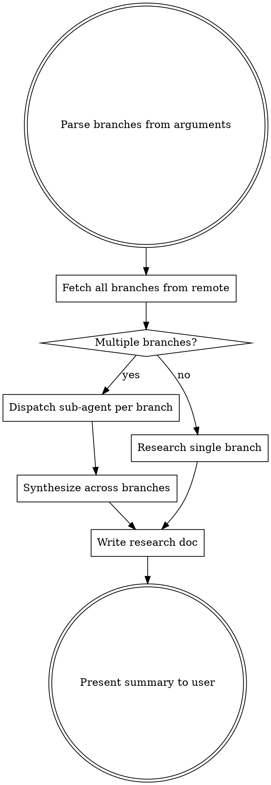

# Resurrect Work from Old Branches

Research one or more old remote branches and produce a single research document summarizing what was done, what was learned, and what's worth carrying forward. This skill gathers intel — it does NOT start implementation or create plans.

## Input

The user provides `$ARGUMENTS` containing:
1. **Mental context** — what they remember about the work (goals, decisions, dead ends)
2. **Branch names** — one or more remote branch refs to research

## Process



### Step 1: Fetch branches

```bash
git fetch origin <branch1> <branch2> ...
```

Handle cases where local main differs from remote — always use `origin/main` as the comparison base. If a branch forked from a different base, detect this via `git merge-base`.

### Step 2: Per-branch research (use sub-agents for 2+ branches)

Each branch analysis MUST include:

1. **Basics**: merge base, commit count, date range, files changed count
2. **Divergence from current main**: how many commits behind `origin/main`? List the commits that have landed in main since this branch forked, with a relevance/conflict-risk rating for each (low/medium/high).
3. **Commits**: full `git log origin/main..<branch>` with messages
4. **Plan documents**: find and **include the full, verbatim content** of any `.md` files that are new or significantly changed vs the merge base. These are the most valuable artifacts — they contain the author's thinking, decisions, and roadmap. Use `git diff <merge-base>..<branch> -- '*.md'` to find them, then `git show <branch>:<path>` to read the complete file. **Do NOT summarize, abbreviate, or paraphrase plan docs.** Copy them verbatim — every table, every bullet, every phase. The user needs to read the original thinking, not your interpretation of it.
5. **Key code changes**: summarize the major structural changes (new files, deleted files, moved files, significant modifications). Use `git diff --stat` and `git diff --name-status` to get the picture, then read specific files that seem important.
6. **Dead ends**: look for reverted commits, TODOs, commented-out code, or plan items marked as abandoned/skipped. These are valuable — they tell the user what was tried and didn't work.

### Step 3: Cross-branch synthesis (for 2+ branches)

After all per-branch research completes, produce a synthesis:

- **Timeline**: which branch came first? Did one evolve from the other?
- **Overlap**: what changes appear in multiple branches?
- **Divergence**: where did the branches take different approaches to the same problem?
- **Progression**: did later branches learn from earlier ones? What was refined?
- **User context mapping**: explicitly connect the user's mental context from `$ARGUMENTS` to what was found in the branches. "You mentioned X — this corresponds to Y in branch Z."

### Step 4: Write the research document

Save to `resurrect-research.md` in the current working directory. Structure:

```markdown
# Resurrect Research: <topic from user context>

## Your Context
<paraphrase what the user told you about the work>

## Branch Summary
<quick comparison table: branch, date, commits, status>

## Branch: <name>
### Overview
### Plan Documents
<For each plan doc, use a collapsible section with full verbatim content:>
<details>
<summary>plan.md (from branch-name)</summary>

[full verbatim content here — every line, table, bullet]
</details>
### Key Changes
### Dead Ends / Abandoned Work

## Branch: <name>
...repeat...

## Synthesis
### Timeline & Progression
### What Overlaps
### Where They Diverge
### Mapping to Your Context
<connect user's mental context to findings>

## Carry-Forward Candidates
<list specific changes/ideas worth preserving, with branch + file refs>
<do NOT recommend an approach — just present the options>
```

## Important Rules

- **Include plan doc content in full.** These are the highest-value artifacts. Never just say "found plan.md" — show it.
- **Use `origin/main` as comparison base**, not local `main`. The user's local main may differ.
- **Don't recommend an approach.** Present the intel and let the user decide. They have context you don't.
- **Don't start implementation.** This skill produces a research doc. The user will chain into brainstorming/planning skills afterward.
- **Use sub-agents for parallelism.** Each branch MUST be researched by a separate sub-agent when there are 2+ branches. Dispatch all branch research agents in a single message with multiple Agent tool calls. This is faster and keeps context cleaner. Do NOT research branches sequentially.
- **Note the divergence from current main.** The user needs to know how stale these branches are and what they'd need to rebase over.

## After Completion

Tell the user the research doc is ready and suggest next steps:
- Review the doc, especially plan documents, to refresh their memory
- Use `/superpowers:brainstorming` to explore the re-implementation approach
- Use `/superpowers:writing-plans` to create an implementation plan
